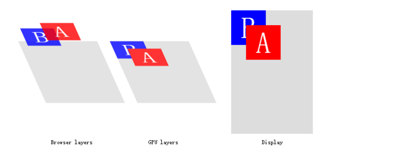
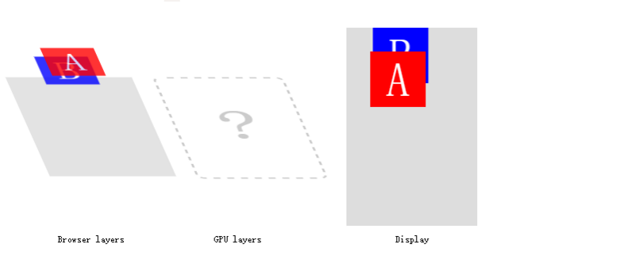
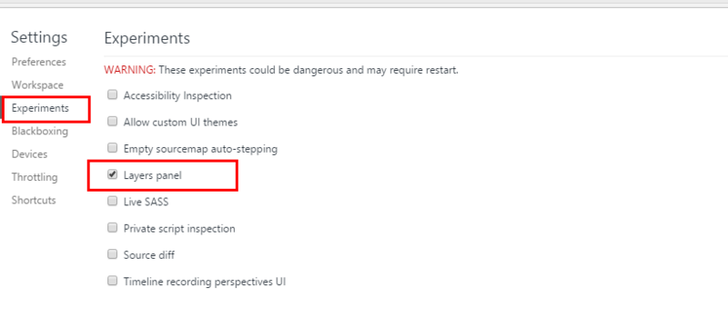

## 浏览器渲染

提高动画的优化不得不提及浏览器是如何渲染一个页面。在从服务器中拿到数据后，浏览器会先做解析三类东西：

1. 解析html,xhtml,svg这三类文档，形成dom树。
2. 解析css，产生css rule tree。
3. 解析js，js会通过api来操作dom tree和css rule tree。

解析完成之后，浏览器引擎会通过dom tree和css rule tree来构建rendering tree：

1. rendering tree和dom tree并不完全相同，例如：`<head></head>`或display:none的东西就不会放在渲染树中。
2. css rule tree主要是完成匹配，并把css rule附加给rendering tree的每个element。

在渲染树构建完成后：

1. 浏览器会对这些元素进行定位和布局，这一步也叫做reflow或者layout。
<!-- more -->
2. 浏览器绘制这些元素的样式，颜色，背景，大小及边框等，这一步也叫做repaint。
3. 然后浏览器会将各层的信息发送给GPU，GPU会将各层合成；显示在屏幕上。

## 渲染优化原理

如上所说，渲染树构建完成后；浏览器要做的步骤：

reflow ——> repaint ——> composite

1. ### reflow和repaint

  reflow和repaint都是耗费浏览器性能的操作，这两者尤以reflow为甚；因为每次reflow，浏览器都要重新计算每个元素的形状和位置。

  由于reflow和repaint都是非常消耗性能的，我们的浏览器为此做了一些优化。浏览器会将reflow和repaint的操作积攒一批，然后做一次reflow。但是有些时候，你的代码会强制浏览器做多次reflow。例如：

  ```
  var content = document.getElementById('content');

  content.style.width = 700px;

  var contentWidth = content.offsetWidth;

  content.style.backgound = 'red';
  ```

    以上第三行代码，需要浏览器reflow后；再获取值，所以会导致浏览器多做一次reflow。

  下面是一些针对reflow和repaint的最佳实践：

  - 不要一条一条地修改dom的样式，尽量使用className一次修改。

  - 将dom离线后修改
    * 使用documentFragment对象在内存里操作dom。
    * 先把dom节点display:none;（会触发一次reflow）。然后做大量的修改后，再把它显示出来。
    * clone一个dom节点在内存里，修改之后；与在线的节点相替换。

  - 不要使用table布局，一个小改动会造成整个table的重新布局。

  - transform和opacity只会引起合成，不会引起布局和重绘。

  从上述的最佳实践中你可能发现，动画优化一般都是**尽可能地减少reflow、repaint的发生**。关于哪些属性会引起reflow、repaint及composite，你可以在[这个网站]找到(https://csstriggers.com/)

2. ### composite

  在reflow和repaint之后，浏览器会将多个复合层传入GPU；进行合成工作，那么合成是如何工作的呢？

  假设我们的页面中有A和B两个元素，它们有absolute和z-index属性；浏览器会重绘它们，然后将图像发送给GPU；然后GPU将会把多个图像合成展示在屏幕上。

  ```！
  <style>
  #a, #b {
  position: absolute;
  }

  #a {
  left: 30px;
  top: 30px;
  z-index: 2;
  }

  #b {
  z-index: 1;
  }
  </style>
  <div id="#a">A</div>
  <div id="#b">B</div>
  ```

  

  在这个例子中，对于动画的每一帧；浏览器会计算元素的几何形状，渲染新状态的图像；并把它们发送给GPU。（你没看错，position也会引起浏览器重排的）尽管浏览器做了优化，在repaint时，只会repaint部分区域；但是我们的动画仍然不够流畅。

  因为重排和重绘发生在动画的每一帧，一个有效避免reflow和repaint的方式是我们仅仅画两个图像；一个是a元素，一个是b元素及整个页面；我们将这两张图片发送给GPU，然后动画发生的时候；只做两张图片相对对方的平移。也就是说，仅仅合成缓存的图片将会很快；这也是GPU的优势——它能非常快地以亚像素精度地合成图片，并给动画带来平滑的曲线。

  为了仅发生composite，我们做动画的css property必须满足以下三个条件：

  - 不影响文档流。

  - 不依赖文档流。

  - 不会造成重绘。

  满足以上以上条件的css property只有transform和opacity。你可能以为position也满足以上条件，但事实不是这样，举个例子left属性可以使用百分比的值，依赖于它的offset parent。还有em、vh等其他单位也依赖于他们的环境。

  我们使用translate来代替left

  ```!
  <style>
  #a, #b {
  position: absolute;
  }

  #a {
  left: 10px;
  top: 10px;
  z-index: 2;
  animation: move 1s linear;
  }

  #b {
  left: 50px;
  top: 50px;
  z-index: 1;
  }

  @keyframes move {
  from { transform: translateX(0); }
  to { transform: translateX(70px); }
  }
  </style>
  <div id="#a">A</div>
  <div id="#b">B</div>
  ```

  浏览器在动画执行之前就知道动画如何开始和结束，因为浏览器没有看到需要reflow和repaint的操作；浏览器就会画两张图像作为复合层，并将它们传入GPU。

  这样做有两个优势：

  - 动画将会非常流畅

  - 动画不在绑定到CPU，即使js执行大量的工作；动画依然流畅。

  看起来性能问题好像已经解决了？在下文你会看到GPU动画的一些问题。

## GPU是如何合成图像的

GPU实际上可以看作一个独立的计算机，它有自己的处理器和存储器及数据处理模型。当浏览器向GPU发送消息的时候，就像向一个外部设备发送消息。

你可以把浏览器向GPU发送数据的过程，与使用ajax向服务器发送消息非常类似。想一下，你用ajax向服务器发送数据，服务器是不会直接接受浏览器的存储的信息的。你需要收集页面上的数据，把它们放进一个载体里面（例如JSON），然后发送数据到远程服务器。

同样的，浏览器向GPU发送数据也需要先创建一个载体；只不过GPU距离CPU很近，不会像远程服务器那样可能几千里那么远。但是对于远程服务器，2秒的延迟是可以接受的；但是对于GPU，几毫秒的延迟都会造成动画的卡顿。

浏览器向GPU发送的数据载体是什么样？这里给出一个简单的制作载体，并把它们发送到GPU的过程。

- 画每个复合层的图像
- 准备图层的数据
- 准备动画的着色器（如果需要）
- 向GPU发送数据

所以你可以看到，每次当你添加**transform:translateZ(0)**或**will-change：transform**给一个元素，你都会做同样的工作。重绘是非常消耗性能的，在这里它尤其缓慢。在大多数情况，浏览器不能增量重绘。它不得不重绘先前被复合层覆盖的区域。

1. ### 隐式合成

  还记得刚才a元素和b元素动画的例子吗？现在我们将b元素做动画，a元素静止不动。

  

  和刚才的例子不同，现在b元素将拥有一个独立复合层；然后它们将被GPU合成。但是因为a元素要在b元素的上面（因为a元素的z-index比b元素高），那么浏览器会做什么？浏览器会将a元素也单独做一个复合层！

  所以我们现在有三个复合层a元素所在的复合层、b元素所在的复合层、其他内容及背景层。

  一个或多个没有自己复合层的元素要出现在有复合层元素的上方，它就会拥有自己的复合层；这种情况被称为隐式合成。

  浏览器将a元素提升为一个复合层有很多种原因，下面列举了一些：

  - 3d或透视变换css属性，例如translate3d,translateZ等等（js一般通过这种方式，使元素获得复合层）

  - `<video><iframe><canvas>`<webgl>等元素。

  - 混合插件（如flash）。

  - 元素自身的 opacity和transform 做 CSS 动画。

  - 拥有css过滤器的元素。

  - 使用will-change属性。

  - position:fixed。

  - 元素有一个 z-index 较低且包含一个复合层的兄弟元素(换句话说就是该元素在复合层上面渲染)

  这看起来css动画的性能瓶颈是在重绘上，但是真实的问题是在内存上：

2. ### 内存占用

  使用GPU动画需要发送多张渲染层的图像给GPU，GPU也需要缓存它们以便于后续动画的使用。

  一个渲染层，需要多少内存占用？为了便于理解，举一个简单的例子；一个宽、高都是300px的纯色图像需要多少内存？

  300 300 4 = 360000字节，即360kb。这里乘以4是因为，每个像素需要四个字节计算机内存来描述。

  假设我们做一个轮播图组件，轮播图有10张图片；为了实现图片间平滑过渡的交互；为每个图像添加了will-change:transform。这将提升图像为复合层，它将多需要19mb的空间。800 600 4 * 10 = 1920000。

  仅仅是一个轮播图组件就需要19m的额外空间！

  在chrome的开发者工具中打开setting——》Experiments——》layers可以看到每个层的内存占用。如图所示：

  

## GPU动画的优点和缺点

现在我们可以总结一下GPU动画的优点和缺点：
- 每秒60帧，动画平滑、流畅。
- 一个合适的动画工作在一个单独的线程，它不会被大量的js计算阻塞。
- 3D“变换”是便宜的。

缺点：
- 提升一个元素到复合层需要额外的重绘，有时这是慢的。（即我们得到的是一个全层重绘，而不是一个增量）
- 绘图层必须传输到GPU。取决于层的数量和传输可能会非常缓慢。这可能让一个元素在中低档设备上闪烁。
- 每个复合层都需要消耗额外的内存，过多的内存可能导致浏览器的崩溃。
- 如果你不考虑隐式合成，而使用重绘；会导致额外的内存占用，并且浏览器崩溃的概率是非常高的。
- 我们会有视觉假象，例如在Safari中的文本渲染，在某些情况下页面内容将消失或变形。

## 优化技巧

1. ### 避免隐式合成

 1. 保持动画的对象的z-index尽可能的高。理想的，这些元素应该是body元素的直接子元素。当然，这不是总可能的。所以你可以克隆一个元素，把它放在body元素下仅仅是为了做动画。
 2. 将元素上设置will-change CSS属性，元素上有了这个属性，浏览器会提升这个元素成为一个复合层（不是总是）。这样动画就可以平滑的开始和结束。但是不要滥用这个属性，否则会大大增加内存消耗。

2. ### 动画中只使用transform和opacity

  如上所说，transform和opacity保证了元素属性的变化不影响文档流、也不受文档流影响；并且不会造成repaint。
  有些时候你可能想要改变其他的css属性，作为动画。例如：你可能想使用background属性改变背景：

  ```
  <div class="bg-change"></div>
  .bg-change {
    width: 100px;
    height: 100px;
    background: red;
    transition: opacity 2s;
  }
  .bg-change:hover {
    background: blue;
  }
  ```

  在这个例子中，在动画的每一步；浏览器都会进行一次重绘。我们可以使用一个复层在这个元素上面，并且仅仅变换opacity属性：

  ```
  <div class="bg-change"></div>
  <style>
  .bg-change {
    width: 100px;
    height: 100px;
    background: red;
  }
  .bg-change::before {
    content: '';
    display: block;
    width: 100%;
    height: 100%;
    background: blue;
    opacity: 0;
    transition: opacity 20s;
  }
  .bg-change:hover::before {
    opacity: 1;
  }
  </style>
  ```

3. ### 减小复合层的尺寸

  看一下两张图片，有什么不同吗？

  

  这两张图片视觉上是一样的，但是它们的尺寸一个是39kb；另外一个是400b。不同之处在于，第二个纯色层是通过scale放大10倍做到的。

  ```!
  <div id="a"></div>
  <div id="b"></div>

  <style>
  #a, #b {
  will-change: transform;
  }

  #a {
  width: 100px;
  height: 100px;
  }

  #b {
  width: 10px;
  height: 10px;
  transform: scale(10);
  }
  </style>
  ```

  对于图片，你要怎么做呢？你可以将图片的尺寸减少5%——10%，然后使用scale将它们放大；用户不会看到什么区别，但是你可以减少大量的存储空间。

4. ### 用css动画而不是js动画

  css动画有一个重要的特性，它是完全工作在GPU上。因为你声明了一个动画如何开始和如何结束，浏览器会在动画开始前准备好所有需要的指令；并把它们发送给GPU。而如果使用js动画，浏览器必须计算每一帧的状态；为了保证平滑的动画，我们必须在浏览器主线程计算新状态；把它们发送给GPU至少60次每秒。除了计算和发送数据比css动画要慢，主线程的负载也会影响动画； 当主线程的计算任务过多时，会造成动画的延迟、卡顿。

  所以尽可能地使用基于css的动画，不仅仅更快；也不会被大量的js计算所阻塞。

## 优化技巧总结

- 减少浏览器的重排和重绘的发生。

- 不要使用table布局。

- css动画中尽量只使用transform和opacity，这不会发生重排和重绘。

- 尽可能地只使用css做动画。

- 避免浏览器的隐式合成。

- 改变复合层的尺寸。

## 参考

GPU合成主要参考：

[https://www.smashingmagazine....](https://www.smashingmagazine)

哪些属性会引起reflow、repaint及composite，你可以在这个网站找到：

[https://csstriggers.com/](https://csstriggers.com)